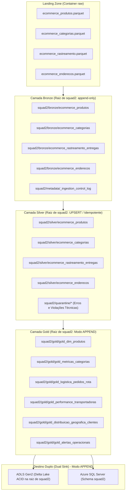
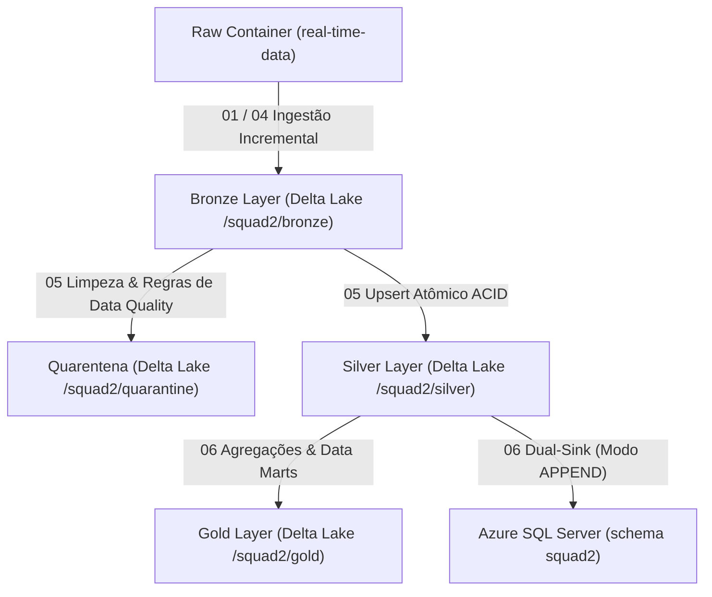

# 🚀 Squad 2 — Real Time for Business (Esteira Unificada)
## Dupla 1 & Dupla 5 (Grupo 1 & Grupo 5 Integrados)

**Integrantes:** Zaiden Emiliano Segundo Seleme & Lucas Sousa Santos Oliveira  
**Branch Git Unificada:** `feat/squad2-dupla1e5`  
**Liderança Técnica (Tech Lead):** Geovany Aparecido Duarte Câncio  
**Scrum Master:** Patrick Marangoni Neri da Silva  
**Product Owner:** Vinícius de Souza Silveira  

---

### 📌 1. Escopo e Governança
A **Squad 2 — Real Time for Business** é responsável pelo processamento distribuído em streaming/micro-lotes sobre o **Azure Data Lake Storage Gen2 (ADLS Gen2)** e o **Azure SQL Server**.

Esta branch unifica integralmente as 4 tabelas de tempo real, persistindo as Delta Tables diretamente na **raiz do contêiner `squad2`** (eliminando a segregação legada por subpastas `/grupo1/` e `/grupo5/`):
* `ecommerce_produtos` (Catálogo de Produtos)
* `ecommerce_categorias` (Taxonomia e Árvore de Categorias)
* `ecommerce_rastreamento_entregas` (Logística de Entregas)
* `ecommerce_enderecos` (Inteligência Geográfica de Clientes)

#### Matriz Oficial de Tabelas da Squad 2:
| Tabela | Formato de Origem | Chave Primária (PK) | Chave Estrangeira (FK) | Volumetria & Schema Evolution |
| :--- | :--- | :--- | :--- | :--- |
| **`ecommerce_produtos`** | Parquet (`.parquet`) | `sku` | `id_categoria` | 4.800 linhas brutas $\rightarrow$ **2.874 SKUs únicos** (Suporte a Schema Evolution: nova coluna `preco_custo` a partir de 08/10/2026) |
| **`ecommerce_categorias`** | Parquet (`.parquet`) | `id_categoria` | `id_categoria_pai` | 810 linhas brutas $\rightarrow$ **135 Categorias únicas** |
| **`ecommerce_rastreamento_entregas`** | Parquet (`.parquet`) | `id_rastreamento` | `id_pedido_ecommerce` | 3.600 linhas brutas $\rightarrow$ **3.600 Eventos únicos** (Multi-status homologado em 08/10) |
| **`ecommerce_enderecos`** | Parquet (`.parquet`) | `id_endereco` | `id_cliente` | 4.200 linhas brutas $\rightarrow$ **4.200 Endereços únicos** |

---

### 🏛️ 2. Arquitetura Medallion Ponta a Ponta (Raiz do Contêiner `squad2`)

#### Estratégias de Persistência e Princípios de Engenharia:
* **Padronização na Raiz do Contêiner `squad2`:** Todas as camadas residem em `abfss://squad2@{storage_account}.dfs.core.windows.net/` sob pastas estruturais limpas (`/bronze/`, `/silver/`, `/quarantine/`, `/gold/`, `/metadata/`).
* **Bronze Imutável (Append-Only):** A Bronze é a fonte única da verdade, retendo 100% dos micro-lotes ingeridos sem qualquer perda histórica.
* **Padronização Temporal Estrita:** Sessão do Spark e timestamps configurados globalmente no fuso de Brasília (`America/Sao_Paulo` - UTC-3).
* **Camada Silver (Deduplicação & UPSERT):**
  * Utiliza deduplicação por chave primária de negócio (`sku`, `id_categoria`, `id_rastreamento`, `id_endereco`) e upsert atômico ACID via anti-join broadcast + `unionByName` + `overwrite`, eliminando duplicações e garantindo idempotência irrestrita.
* **Camada Gold (Destino Duplo em Modo APPEND):**
  * Persistência em **modo `append`** no **Destino Duplo** (Delta Lake e Azure SQL Server).
  * Cada execução registra novos snapshots e agregações analíticas carimbadas com `gold_processed_at`, viabilizando a **historização temporal de métricas, KPIs e alertas operacionais** para consumo direto em relatórios e dashboards (Power BI / Grafana).

---

### 📁 3. Resumo da Esteira Medallion da Squad 2

A esteira da Squad 2 é orquestrada através de 7 notebooks modulares com execução sequencial e proteção defensiva de ponta a ponta:

#### Detalhamento Funcional dos 7 Notebooks:

1. **`00_setup_config.ipynb` (Setup & Conectividade):**
   * Configuração das credenciais seguras do Service Principal (Microsoft Entra ID) e banco relacional via `.env` dinâmico (`find_dotenv()`).
   * Configuração global do timezone `America/Sao_Paulo`.
   * Injeção de credenciais OAuth Spark FQDN (`adls_options`) e validação eager de portas de rede (ADLS Gen2 porta 443 e SQL Server porta 1433).
   * Mapeamento centralizado de todos os caminhos de dados (Bronze, Silver, Quarentena, Gold e controle de metadados).

2. **`01_extracao_distribuida_eda.ipynb` (Extração & EDA):**
   * Leitura resiliente de arquivos brutos via PyArrow, contornando limitações de tipos `TIMESTAMP_NANOS` e inteiros nulos no Databricks Serverless.
   * Validação de Schema Completo (Técnica 1) com bloqueio do pipeline caso colunas vitais estejam ausentes.
   * Análise Exploratória de Dados (EDA) unificada com estatísticas descritivas, cardinalidade e detecção de anomalias preliminares.

3. **`02_carga_sqlserver.ipynb` (Carga Relacional Inicial):**
   * Persistência inicial das 4 tabelas no catálogo `squad2` do Azure SQL Server.
   * **Proteção contra truncamento acidental:** se o lote bruto estiver vazio, a operação é abortada com segurança preservando o banco.
   * Suporte nativo ao conector `format("sqlserver")` com contingência via `pyodbc` (`fast_executemany`).

4. **`03_auditoria_data_quality.ipynb` (Auditoria de Qualidade SQL):**
   * Auditoria de integridade relacional diretamente no banco via conector nativo `format("sqlserver")`.
   * Verificação de 100% de unicidade e zero nulos nas chaves primárias (`sku`, `id_categoria`, `id_rastreamento`, `id_endereco`).
   * Validação de integridade referencial entre produtos e categorias (zero órfãos).

5. **`04_bronze_ingestao_delta.ipynb` (Ingestão Incremental Bronze):**
   * Ingestão incremental append-only particionada por dia (`data_particao`) diretamente na raiz de `squad2/bronze/`.
   * **Validação de Schema Completo Parquet (Técnica 1):** bloqueio imediato com `ValueError` caso qualquer micro-lote chegue sem campos obrigatórios.
   * **Watermark de Arquivos Vazios no Control Log:** arquivos com 0 linhas são registrados no `_ingestion_control_log` com `quantidade_linhas = 0`. Nas execuções seguintes, o anti-join os ignora, eliminando custos de I/O desnecessários.
   * Metadados técnicos anexados: `bronze_source_file` e `bronze_ingested_at`.

6. **`05_silver_limpeza_tratamento.ipynb` (Curadoria Silver & Quarentena):**
   * Aplicação rigorosa das regras técnicas de Data Quality com sanitização prévia:
     * **Sanitização de CEP (Técnica 3):** remoção de caracteres não-numéricos (hífen, pontos), garantindo que CEPs válidos como `"14180-000"` se tornem `"14180000"` com 8 dígitos e não sejam reprovados por falso positivo.
     * **Normalização de Status de Rastreio (Técnica 2):** conversão para minúsculas e substituição de múltiplos espaços por sublinhado (`regexp_replace(lower(trim(col("status_entrega"))), r"\s+", "_")`).
     * **Tolerância de Clock Skew (Técnica 3):** janela de graça de 10 minutos para timestamps ligeiramente à frente do relógio do servidor (`dt_evento <= current_timestamp() + 10 MINUTES`).
     * **Integridade Referencial Cross-Squad (Técnica 5):** validação contra a tabela `silver/ecommerce_pedidos`, enviando para quarentena eventos de rastreio de pedidos inexistentes.
   * Registros reprovados são desviados para `squad2/quarantine/` com justificativa técnica rastreável.
   * **Upsert Atômico ACID:** deduplicação por chave de negócio preservando o histórico operacional de eventos.

7. **`06_gold_metricas_analiticas.ipynb` (Data Marts, Alertas & Destino Duplo):**
   * Construção de **6 Data Marts Analíticos** de alto valor para BI e governança em tempo real.
   * **Destino Duplo (Dual-Sink):** gravação simultânea no Delta Lake e no Azure SQL Server em **modo `append`** com historização temporal.
   * **Resiliência Automática de Schema:** sincronização e alinhamento de colunas com a DDL oficial do SQL Server.

---

### 🛡️ 4. Matriz Completa de Regras Técnicas, de Negócio e Governança

| Entidade | Regra | Tipo | Comportamento / Ação Implementada |
| :--- | :--- | :---: | :--- |
| `ecommerce_produtos` | $5 < \text{len}(sku) < 60$ e não-nulo | **Técnica 1** | Enviado para Quarentena com motivo documentado. |
| `ecommerce_produtos` | $0 < preco\_lista < 5000$ e não-nulo | **Técnica 2** | Enviado para Quarentena (preços fora de faixa operacional). |
| `ecommerce_produtos` | `is_ativo` booleano e não-nulo | **Técnica 3** | Enviado para Quarentena se nulo. |
| `ecommerce_produtos` | `preco_custo <= 0` (quando preenchido) | **Técnica 6** | Enviado para Quarentena com motivo técnico rastreável. |
| `ecommerce_produtos` | `preco_custo > preco_lista` | **Negócio 7** | **Alerta Operacional Alto** em `gold_alertas_operacionais` (Margem Negativa / Prejuízo). |
| `ecommerce_produtos` | $> 50$ novos SKUs no micro-lote | **Negócio 4** | **Alerta Operacional Médio** gravado em `gold_alertas_operacionais` (suspeita de carga de teste). |
| `ecommerce_produtos` | `is_ativo == True` com `preco_lista <= 0` | **Negócio 5** | **Alerta Operacional Crítico** gravado em `gold_alertas_operacionais` (prevenção de prejuízo por bug de pricing). |
| `ecommerce_categorias` | `id_categoria` e `nome_categoria` obrigatórios | **Técnica 1** | Enviado para Quarentena se nulos ou vazios. |
| `ecommerce_categorias` | Alteração na contagem de categorias raiz | **Negócio 2** | **Alerta Operacional Alto** gravado em `gold_alertas_operacionais` (mudança não planejada na taxonomia). |
| `ecommerce_rastreamento`| Schema Parquet completo (6 colunas vitais) | **Técnica 1** | Bloqueia pipeline com `ValueError` em Raw/Bronze e quarentena em Silver. |
| `ecommerce_rastreamento`| `status_entrega` no catálogo oficial (9 status) | **Técnica 2** | Normalizado com regex e enviado para Quarentena se inválido. |
| `ecommerce_rastreamento`| Data do evento não-futura (+10 min grace period)| **Técnica 3** | Tolerância a clock skew; além disso é enviado para Quarentena. |
| `ecommerce_rastreamento`| Histórico e granularidade de eventos preservados| **Técnica 4** | Deduplicação por `id_rastreamento` mantendo histórico de movimentações. |
| `ecommerce_rastreamento`| Integridade referencial com pedidos | **Técnica 5** | Broadcast join com `silver/ecommerce_pedidos`; órfãos enviados para Quarentena. |
| `ecommerce_rastreamento`| Throughput última milha em tempo real | **Negócio 6** | Métrica `pedidos_em_rota_ultimas_2h` calculada no Data Mart 3. |
| `ecommerce_rastreamento`| SLA de Entrega $\le$ 7 dias (`dt_evento - dt_pedido`) | **Negócio 7** | Métricas `total_entregues_no_prazo`, `total_entregues_com_atraso` e `taxa_sla_entrega_pct` no Data Mart 3. |
| `ecommerce_rastreamento`| Evento `'entregue'` duplicado para o mesmo pedido | **Negócio 8** | **Alerta Operacional Alto** gravado em `gold_alertas_operacionais` (bug na integração da transportadora). |
| `ecommerce_rastreamento`| Ranking Top 3 transportadoras por volume | **Negócio 9** | Coluna `ranking_volume_dia` calculada via `dense_rank()` no Data Mart 4. |
| `ecommerce_rastreamento`| Encomenda estagnada > 3 dias após `'coletado'` | **Negócio 10** | **Alerta Operacional Crítico** gravado em `gold_alertas_operacionais` (encomenda sumida / perda logística). |
| `ecommerce_enderecos` | Chaves obrigatórias preenchidas | **Técnica 1** | Enviado para Quarentena se nulas. |
| `ecommerce_enderecos` | UF válida (pertencente às 27 UFs brasileiras) | **Técnica 2** | Sanitizado com `upper(trim())` e validado contra catálogo das 27 UFs. |
| `ecommerce_enderecos` | CEP numérico com exatamente 8 dígitos | **Técnica 3** | Sanitização regex `[^0-9]` prévia; se diferente de 8 dígitos vai para Quarentena. |
| `ecommerce_enderecos` | Distribuição geográfica em tempo real | **Negócio 4** | KPI de penetração e densidade por estado no Data Mart 5. |
| `ecommerce_enderecos` | $> 3$ endereços por cliente no mesmo micro-lote | **Negócio 5** | **Alerta Operacional Alto** gravado em `gold_alertas_operacionais` (violação do gerador / suspeita de fraude). |

---

### 📊 5. Data Marts Analíticos da Camada Gold (Modo Append & Dual Sink)

1. **`gold_dim_produtos`:** Dimensão desnormalizada de produtos com hierarquia completa (categoria pai/filha), faixas mercadológicas de preço (Econômica, Padrão, Premium, Luxo), indicadores de rentabilidade unitária com base no custo de aquisição (`preco_custo`, `margem_bruta_unitaria`, `margem_lucro_pct`, `status_rentabilidade`) e flags de disponibilidade comercial.
2. **`gold_metricas_categorias`:** KPIs executivos por categoria e agregação raiz (volumetria ativo/inativo, taxa de disponibilidade percentual, ticket médio/mínimo/máximo e amplitude de preços).
3. **`gold_logistica_pedidos_rota`:** Throughput diário e funil logístico integrado:
   * Volumes: `total_coletados`, `total_em_transito`, `total_em_rota`, `total_entregues`, `total_falhas`.
   * **Monitoramento Tempo Real (Negócio 6):** `pedidos_em_rota_ultimas_2h`.
   * **Aferição de SLA de 7 dias (Negócio 7):** `total_entregues_no_prazo`, `total_entregues_com_atraso` e `taxa_sla_entrega_pct`.
   * `taxa_sucesso_pct` geral das entregas.
4. **`gold_performance_transportadoras`:** Scorecard operacional de transportadoras com volume movimentado, total de pedidos atendidos, entregas concluídas, falhas e ranking diário (`ranking_volume_dia` com `dense_rank()`, atendendo ao Negócio 9).
5. **`gold_distribuicao_geografica_clientes`:** Inteligência geográfica com total de endereços, clientes únicos, endereços principais e taxa de penetração de mercado por UF (atendendo ao Negócio 4 de endereços).
6. **`gold_alertas_operacionais`:** Tabela analítica de observabilidade contínua para áreas de negócio, prevenção a fraudes e monitoramento de anomalias em tempo real:
   * **Schema Oficial:** `data_alerta`, `dominio`, `regra_negocio`, `chave_entidade`, `valor_detectado`, `severidade`, `gold_processed_at`.
   * **Severidades:** `CRÍTICA`, `ALTA`, `MÉDIA`.
   * Consolida disparos automáticos das regras: Endereços Negócio 5, Produtos Negócio 4 e 5, Categorias Negócio 2, Rastreamento Negócio 8 e 10.

---

### ⚙️ 6. Resiliência e Soluções Técnicas para Databricks Serverless

* **Leitor Resiliente Parquet:** Contorna incompatibilidades de inferência com `TIMESTAMP_NANOS` e mismatch `INT32 Null` no Databricks Serverless através de conversão PyArrow direta.
* **Injeção OAuth FQDN:** Configuração das credenciais do Service Principal diretamente via `.options(**adls_options)` em cada chamada Spark, respeitando o isolamento do Unity Catalog / Serverless.
* **Zero RDD & Zero Global Temp Views:** 100% do pipeline opera sobre DataFrames nativos e Catalyst Optimizer.
* **Gestão Idempotente de Micro-Lotes Vazios:** O `_ingestion_control_log` na Bronze rastreia arquivos sem registros (`quantidade_linhas = 0`), prevenindo releituras em loop.
* **Upsert Atômico ACID na Silver:** Elimina a necessidade de APIs sujeitas a restrições de cluster, realizando o upsert por anti-join broadcast + `unionByName` + `overwrite` atômico.
* **Dual Sink com Resiliência de Schema na Gold:** Gravação cumulativa em modo `append` tanto no Delta Lake quanto no Azure SQL Server, com projeção exata das colunas e sincronização com a DDL oficial do banco de dados relacional.
