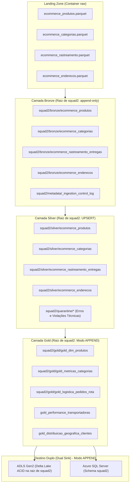

# 🚀 Squad 2 — Real Time for Business (Esteira Unificada)
## Dupla 1 & Dupla 5 (Grupo 1 & Grupo 5 Integrados)

**Integrantes:** Zaiden Emiliano Segundo Seleme & Lucas Sousa Santos Oliveira  
**Branch Git Unificada:** `feat/squad2-dupla1e5`  
**Liderança Técnica (Tech Lead):** Geovany Aparecido Duarte Câncio  
**Scrum Master:** Patrick Marangoni Neri da Silva  
**Product Owner:** Vinícius de Souza Silveira  

---

### 📌 1. Escopo e Governança
A **Squad 2 — Real Time for Business** é responsável pelo processamento distribuído em streaming/micro-lotes sobre o **Azure Data Lake Storage Gen2 (ADLS Gen2)** e o **Azure SQL Server**.

Esta branch unifica integralmente as 4 tabelas de tempo real, persistindo as Delta Tables diretamente na **raiz do contêiner `squad2`** (eliminando a segregação legada por subpastas `/grupo1/` e `/grupo5/`):
* `ecommerce_produtos` (Catálogo de Produtos)
* `ecommerce_categorias` (Taxonomia e Árvore de Categorias)
* `ecommerce_rastreamento_entregas` (Logística de Entregas)
* `ecommerce_enderecos` (Inteligência Geográfica de Clientes)

#### Matriz Oficial de Tabelas da Squad 2:
| Tabela | Formato de Origem | Chave Primária (PK) | Chave Estrangeira (FK) | Volumetria Tempo Real |
| :--- | :--- | :--- | :--- | :--- |
| **`ecommerce_produtos`** | Parquet (`.parquet`) | `sku` | `id_categoria` | 4.800 linhas brutas $\rightarrow$ **2.874 SKUs únicos** |
| **`ecommerce_categorias`** | Parquet (`.parquet`) | `id_categoria` | `id_categoria_pai` | 810 linhas brutas $\rightarrow$ **135 Categorias únicas** |
| **`ecommerce_rastreamento_entregas`** | Parquet (`.parquet`) | `id_rastreamento` | `id_pedido_ecommerce` | 3.600 linhas brutas $\rightarrow$ **3.600 Eventos únicos** |
| **`ecommerce_enderecos`** | Parquet (`.parquet`) | `id_endereco` | `id_cliente` | 4.200 linhas brutas $\rightarrow$ **4.200 Endereços únicos** |

---

### 🏛️ 2. Arquitetura Medallion Ponta a Ponta (Raiz do Contêiner `squad2`)



#### Estratégias de Persistência Definidas em Reunião Técnica:
* **Padronização na Raiz do Contêiner `squad2`:** Todas as camadas residem em `abfss://squad2@{storage_account}.dfs.core.windows.net/` sob pastas estruturais limpas (`/bronze/`, `/silver/`, `/quarantine/`, `/gold/`, `/metadata/`).
* **Camada Silver (UPSERT):**
  * Utiliza `MERGE INTO` atômico (ou fallback atômico Serverless) indexado pela chave primária de negócio (`sku`, `id_categoria`, `id_rastreamento`, `id_endereco`).
  * Atualiza registros coincidentes e insere novos, eliminando duplicações e garantindo idempotência estrita.
* **Camada Gold (Modo APPEND):**
  * Persistência em **modo `append`** no **Destino Duplo** (Delta Lake e Azure SQL Server).
  * Cada execução registra novos snapshots e agregações analíticas carimbadas com `gold_processed_at`, permitindo a **historização temporal de métricas e KPIs** para análise de evolução em relatórios e dashboards.

---

### 📁 3. Sequência de Execução dos Notebooks Unificados

Os notebooks seguem a ordem numérica obrigatória (`00` a `06`) contemplando 100% das 4 tabelas:

```text
squad2/
├── 00_setup_config.ipynb               -> Setup do ambiente, injeção OAuth Spark FQDN e teste de conectividade
├── 01_extracao_distribuida_eda.ipynb   -> Extração distribuída dos micro-lotes brutos e EDA unificado das 4 tabelas
├── 02_carga_sqlserver.ipynb            -> Carga relacional das 4 tabelas no Azure SQL Server (Sprint 1)
├── 03_auditoria_data_quality.ipynb     -> Auditoria de qualidade e integridade relacional no SQL Server
├── 04_bronze_ingestao_delta.ipynb      -> Ingestão incremental Bronze append-only na raiz de squad2 (Sprint 2)
├── 05_silver_limpeza_tratamento.ipynb  -> Curadoria Silver, Quarentena auditável e Upsert Delta MERGE INTO (Sprint 2)
├── 06_gold_metricas_analiticas.ipynb   -> 5 Data Marts Gold com KPIs em Modo APPEND no Destino Duplo (Sprint 3)
└── README.md                           -> Documentação técnica oficial unificada
```

---

### 🛡️ 4. Regras Técnicas, de Negócio e Quarentena

| Entidade | Regra | Tipo | Ação em Falha |
| :--- | :--- | :---: | :--- |
| `ecommerce_produtos` | $5 < \text{len}(sku) < 60$ e não-nulo | Técnica 1 | Quarentena |
| `ecommerce_produtos` | $0 < preco\_lista < 5000$ e não-nulo | Técnica 2 | Quarentena |
| `ecommerce_produtos` | `is_ativo` booleano e não-nulo | Técnica 3 | Quarentena |
| `ecommerce_produtos` | $> 50$ novos SKUs no micro-lote | Negócio 4 | Alerta de Expansão de Catálogo |
| `ecommerce_produtos` | `is_ativo == True` com `preco_lista <= 0` | Negócio 5 | Alerta Crítico Operacional |
| `ecommerce_categorias` | `id_categoria` e `nome_categoria` obrigatórios | Técnica 1 | Quarentena |
| `ecommerce_categorias` | Alteração na contagem de categorias raiz | Negócio 2 | Alerta de Governança |
| `ecommerce_rastreamento`| Chaves obrigatórias preenchidas | Técnica 1 | Quarentena |
| `ecommerce_rastreamento`| `status_entrega` no catálogo oficial (9 status) | Técnica 2 | Quarentena |
| `ecommerce_rastreamento`| `dt_evento <= current_timestamp()` | Técnica 3 | Quarentena |
| `ecommerce_enderecos` | Chaves obrigatórias preenchidas | Técnica 1 | Quarentena |
| `ecommerce_enderecos` | UF válida (pertencente às 27 UFs) | Técnica 2 | Quarentena |
| `ecommerce_enderecos` | CEP numérico com exatamente 8 dígitos | Técnica 3 | Quarentena |

---

### 📊 5. Data Marts Analíticos da Camada Gold (Modo Append)

1. **`gold_dim_produtos`:** Dimensão desnormalizada com categorização hierárquica (categoria pai/filha), faixas mercadológicas de precificação e flag de disponibilidade.
2. **`gold_metricas_categorias`:** KPIs executivos por categoria (volumetria ativo/inativo, taxa de disponibilidade, ticket médio/mínimo/máximo e desvio padrão).
3. **`gold_logistica_pedidos_rota`:** Throughput logístico diário (volumes coletados, em trânsito, em rota, entregues, falhas operacionais e taxa de sucesso percentual).
4. **`gold_performance_transportadoras`:** Scorecard diário e ranking por volume e eficiência operacional de transportadoras (`dense_rank()`).
5. **`gold_distribuicao_geografica_clientes`:** Inteligência geográfica com penetração de clientes e densidade de endereços por estado (UF).

---

### ⚙️ 6. Resiliência e Soluções Técnicas para Databricks Serverless
* **Leitor Resiliente Parquet:** Contorna incompatibilidades de inferência com `TIMESTAMP_NANOS` e mismatch `INT32 Null` no Databricks Serverless através de conversão PyArrow.
* **Injeção OAuth FQDN:** Configuração das credenciais do Service Principal diretamente via `.options(**adls_options)` em cada chamada Spark.
* **Triplo Fallback de Persistência SQL Server:** Suporte nativo com conector `format("sqlserver")`, fallback via JDBC URL e contingência com `pyodbc` (`fast_executemany` em modo append).
* **Upsert Delta Atômico na Silver:** Execução de `DeltaTable.merge()` nativo com fallback atômico via anti-join broadcast para compatibilidade irrestrita.
* **Persistência Append na Gold:** Gravação cumulativa na raiz do contêiner `squad2` com metadados temporais para auditoria analítica e BI.
