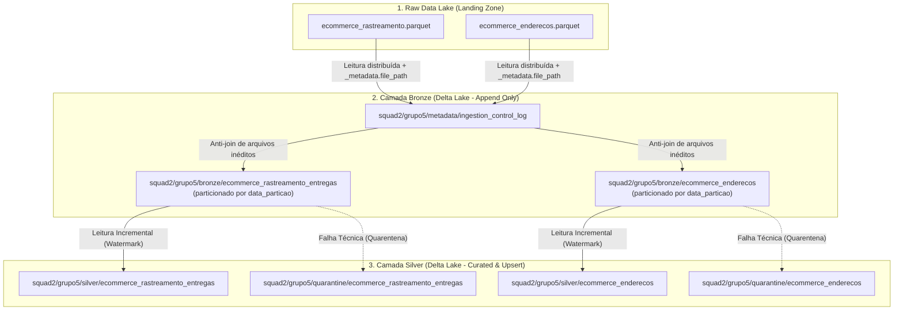

# 🚀 Pipeline de Engenharia de Dados: Camadas Bronze e Silver (Delta Lake)
## Squad 2 — Real Time for Business | Dupla 5 (Grupo 5)

Este diretório contém a esteira completa e resiliente de processamento distribuído no **Databricks** sobre o **Azure Data Lake Storage Gen2 (ADLS Gen2)** para as tabelas sob responsabilidade da **Dupla 5**:
* `ecommerce_rastreamento_entregas` *(fonte: `raw/real-time-data/*/*/*/*/ecommerce_rastreamento.parquet`)*
* `ecommerce_enderecos` *(fonte: `raw/real-time-data/*/*/*/*/ecommerce_enderecos.parquet`)*

---

### 🏛️ Arquitetura da Solução

---

### 📂 Estrutura de Notebooks

| Notebook | Propósito | Destaques Técnicos |
| :--- | :--- | :--- |
| **`00_setup_config.ipynb`** | Configuração do ambiente | Instalação de libs no escopo Serverless, carga dinâmica do `.env` e validação da conexão OAuth FQDN com o ADLS Gen2. |
| **`01_extracao_rastreamento_enderecos.ipynb`** | Análise exploratória & EDA | Leitura paralela dos arquivos brutos no container `raw`, inferência de schema e validação das chaves primárias. |
| **`04_bronze_ingestao_delta.ipynb`** | Ingestão incremental Bronze | Preservação integral do dado bruto (zero cast/filtro), idempotência via `ingestion_control_log`, adição de `bronze_ingested_at` / `bronze_source_file` e particionamento diário. |
| **`05_silver_limpeza_tratamento.ipynb`** | Curadoria, Quarentena e Upsert | Consumo via Watermark temporal, `trim()`, validação de regras com isolamento em Quarentena (`quarantine_reason`), alertas de negócio e persistência atômica via `MERGE INTO` com fallback resiliente. |

---

### 📋 Regras Técnicas e de Negócio Implementadas

#### 1. `ecommerce_rastreamento_entregas` (Chave: `id_rastreamento`)
* **Regra Técnica 1 (Schema Obrigatório):** Verificação de integridade e não-nulidade das chaves (`id_rastreamento`, `id_pedido_ecommerce`, `codigo_rastreio`, `id_transportadora`, `status_entrega`, `dt_evento`).
* **Regra Técnica 2 (Flow Logístico):** `status_entrega` validado contra a lista oficial: `['coletado', 'em_transito', 'saiu_para_entrega', 'entregue', 'falha_na_entrega', 'retirada_agendada', 'devolvido']`.
* **Regra Técnica 3 (Temporalidade):** `dt_evento` não pode ser nula nem futura.
* **Deduplicação Intra-Lote:** `row_number()` particionado por `id_rastreamento` e ordenado por `dt_evento DESC`.
* **Regras de Negócio & Alertas:**
  * *KPI (Regra 6):* Quantidade de pedidos que entraram em `'saiu_para_entrega'` no lote.
  * *Alerta (Regra 8):* Alerta operacional se o mesmo pedido receber evento `'entregue'` repetido.
  * *KPI (Regra 9):* Top 3 transportadoras com maior volume no micro-lote.

#### 2. `ecommerce_enderecos` (Chave: `id_endereco`)
* **Regra Técnica 1 (Schema Obrigatório):** Presença obrigatória de `id_endereco`, `id_cliente`, `logradouro`, `cep`, `cidade`, `estado` e `is_principal`.
* **Regra Técnica 2 (UF Oficial):** Validação estrita do `estado` contra a lista das 27 Unidades Federativas do Brasil.
* **Regra Técnica 3 (CEP Válido):** Remoção de máscaras e validação de exatamente 8 dígitos numéricos.
* **Deduplicação Intra-Lote:** `row_number()` particionado por `id_endereco` e ordenado por `bronze_ingested_at DESC`.
* **Regras de Negócio & Alertas:**
  * *KPI (Regra 4):* Distribuição geográfica de novos endereços cadastrados por estado.
  * *Alerta (Regra 5):* Alerta caso um cliente receba `> 3` endereços no mesmo lote.

---

### 🛡️ Compatibilidade com Databricks Free / Serverless
1. **Configuração FQDN de Storage**:
   `fs.azure.account.auth.type.<storage_account>.dfs.core.windows.net = "OAuth"` injetado em cada chamada Spark, contornando a restrição de `spark.conf.set()` global no Serverless.
2. **Upsert Resiliente**:
   Tentativa nativa com `DeltaTable.merge()`, com chaveamento automático para transação atômica (`left_anti` broadcast + overwrite) caso ocorram restrições de permissão do metastore.
3. **Prevenção ao Small Files Problem**:
   Particionamento diário (`data_particao`) e ativação das flags `delta.autoOptimize.optimizeWrite` e `delta.autoOptimize.autoCompact`.
